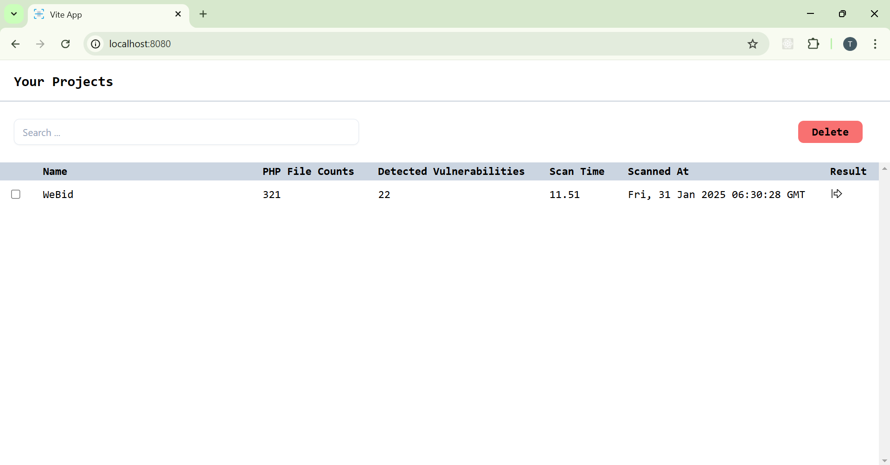
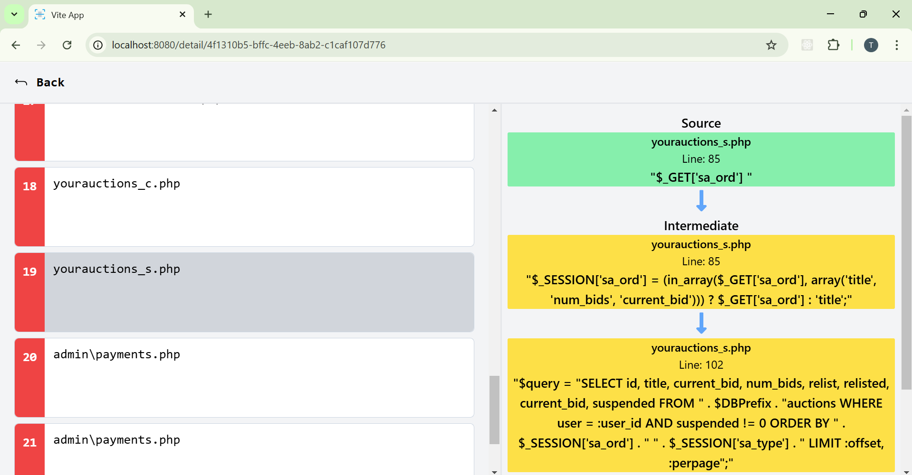

# Static Analysis Tools for Detecting SQLi in PHP Code
This project implement Static Taint Analysis to detect SQL injection vulnerabilities in PHP Code. Using Taint Analysis, this tool trace unstrusted source until used in SQL query. Below some points about the internal implementation:
- Parsing PHP code using [php-parser](https://github.com/VKCOM/php-parser/)
- Form a SSA representation by implementing "[Simple and Efficient Construction of Static Single Assignment Form](https://link.springer.com/chapter/10.1007/978-3-642-37051-9_6)"
- Trace the used of unstrusted source until used in SQL query and check the sanitizer
- Handle operation for type casting, type checking, and type declaration in PHP

## Web App
To visualize the SQLi vulnerabilities, run the web app by following these steps:
1. Install [golang-migrate](https://github.com/golang-migrate/migrate/) and setup the db
```
migrate -source file://db/migrations -database [db-url] up
```
2. Build and run the application
```
go build -o ./bin/web.exe ./cmd/web/
./bin/web.exe
```
3. Access the web app url<br>
  

## Scanner
To build the scanner, you must have golang in your computer and run below command
```
make build-cli
or
go build -o ./bin/sqli-scanner.exe ./cmd/cli
```
Then, the binary placed in `./bin/sqli-scanner.exe` can be execute using below command
```
./bin/sqli-scanner.exe [directory path] [option]
```
You need to specify the directory path which will be scanned and add some options, such as:
- --host: web app host url
- --out: json sqli report file path
- --laravel: using laravel taint analysis rule
- --help: see the program manual

Below the example of how the program run
```
PS D:\src\tugas-akhir\projects_datasets\WeBid> sqli-scanner . --host=http://localhost:8080
Scan 321 php files ...

Detected 22 sqli vulnerabilities in 11.51 second.
Result reported in 'result.json'
```
